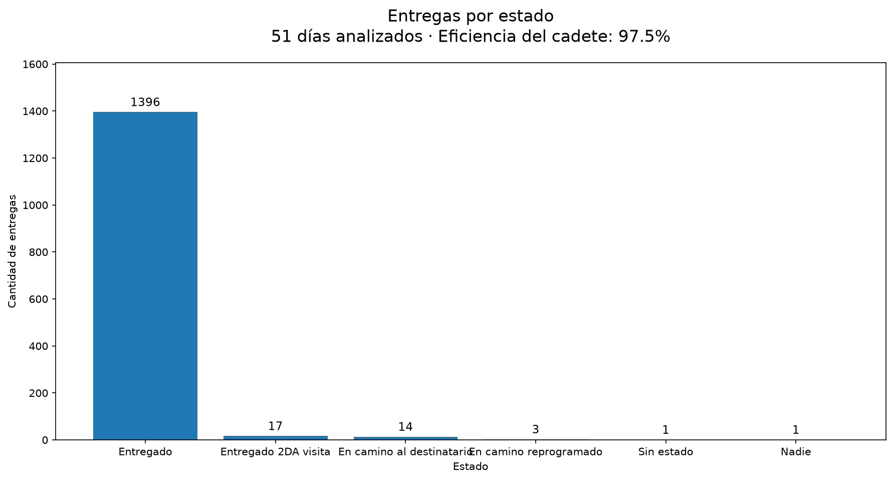
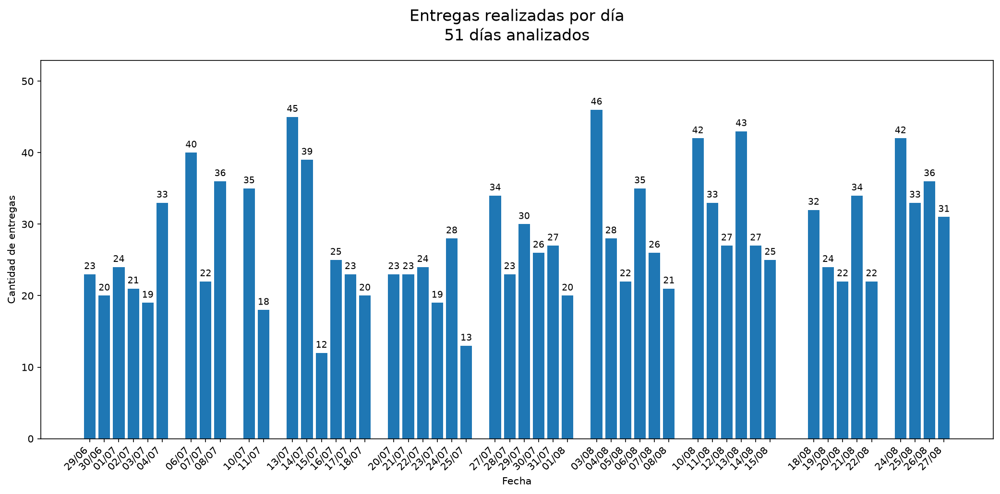
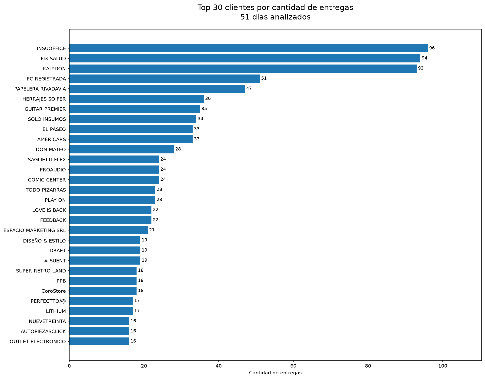
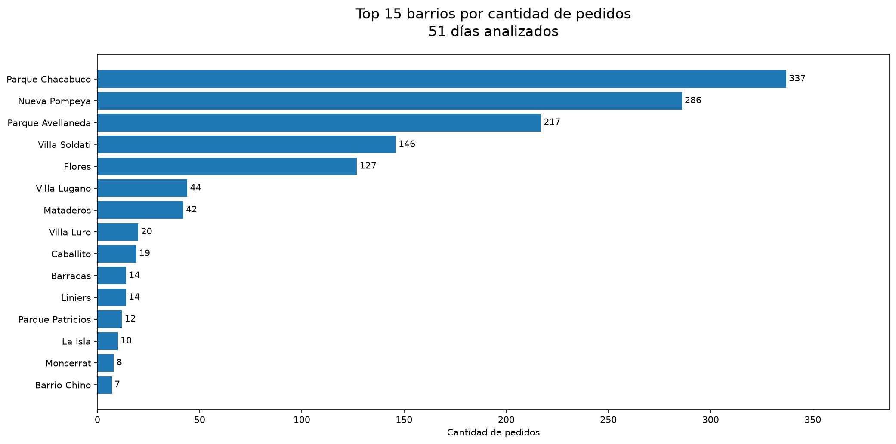
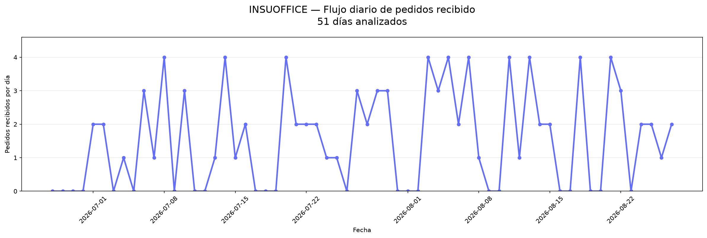
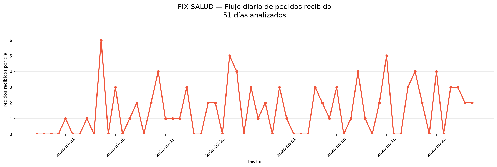
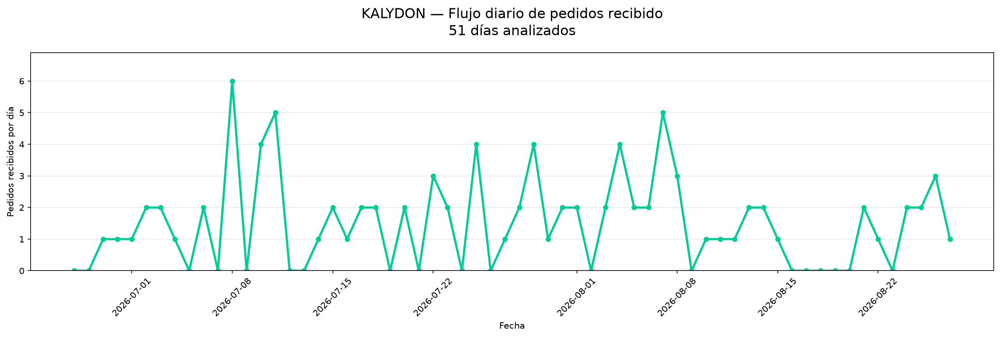

# WYNFLEX — Data Engineering & Analytics Pipeline

Pipeline de Data Engineering desarrollado a partir de archivos Excel de una operación logística.
Pipeline de **Data Engineering y Analytics** desarrollado a partir de archivos Excel provenientes de una operación logística real.

El proyecto implementa un flujo ETL batch que transforma reportes semanales de Excel en Parquet, carga los datos en PostgreSQL y construye un modelo dimensional basado en **Star Schema**.
El proyecto transforma reportes operativos semanales en un flujo de datos reproducible para consolidar entregas, realizar análisis operativos y generar información útil para reporting y toma de decisiones.

Actualmente incorpora:
Actualmente implementa:

* Docker y Docker Compose
* PostgreSQL
* Python + Pandas
* Parquet
* Modelo dimensional
* pytest
* GitHub Actions
* Ingesta incremental e idempotente
* Análisis de datos con Plotly
* Enriquecimiento geográfico mediante geocoding
* ETL batch con Python y Pandas.
* Conversión de Excel a Apache Parquet.
* PostgreSQL como base de datos operacional.
* Carga incremental e idempotente.
* Modelo dimensional basado en Star Schema.
* Docker y Docker Compose.
* Tests automatizados con pytest.
* Continuous Integration mediante GitHub Actions.
* Analytics mediante SQL, Pandas y Plotly.
* Normalización y geocoding de direcciones.
* Construcción de un dataset geográfico reutilizable de WYNFLEX.

---

## 🏗️ Arquitectura
# 🏗️ Arquitectura actual

```text
Excel
  ↓
RAW
  ↓
Extract
  ↓
Transform
  ↓
SILVER (Parquet)
  ↓
PostgreSQL
  ↓
Star Schema
  ↓
Analytics
  ↓
Reporting / Visualización
                         WYNFLEX
                            │
                    Reportes Excel
                            │
                            ▼
                     ┌─────────────┐
                     │    RAW      │
                     │ data/raw/   │
                     └──────┬──────┘
                            │
                            ▼
                       extract.py
                            │
                            ▼
                      transform.py
                            │
                            ▼
                     ┌─────────────┐
                     │   SILVER    │
                     │   Parquet   │
                     │ data/silver │
                     └──────┬──────┘
                            │
                            ▼
                         load.py
                            │
                            ▼
                     ┌─────────────┐
                     │ PostgreSQL  │
                     │ deliveries  │
                     └──────┬──────┘
                            │
                            ▼
                         model.py
                            │
                            ▼
                  ┌─────────────────────┐
                  │     Star Schema     │
                  │                     │
                  │ fact_entregas       │
                  │ dim_cliente         │
                  │ dim_cadete          │
                  │ dim_estado          │
                  │ dim_zona            │
                  │ dim_fecha           │
                  └──────────┬──────────┘
                             │
                             ▼
                       analytics.py
                             │
                             ▼
                   analytics.ipynb
```

### Enriquecimiento geográfico
## Enriquecimiento geográfico

```text
Dirección
    ↓
Direcciones de entregas
          │
          ▼
Normalización
    ↓
          │
          ▼
Geocoding
    ↓
Latitud + Longitud
    ↓
Barrio
    ↓
Analytics geográfico
          │
          ├── Latitud
          ├── Longitud
          ├── Barrio
          └── Código postal
                  │
                  ▼
       Dataset geográfico WYNFLEX
                  │
                  ▼
              Analytics
```

---

## 🔄 Flujo ETL
# 🔄 Flujo ETL

### Extract
## 1. Extract — `src/extract.py`

Los archivos Excel representan reportes semanales de la operación logística.

Los archivos originales se almacenan en:
Entrada:

```text
data/raw/
data/raw/*.xlsx
```

El proceso detecta automáticamente los archivos Excel disponibles para su procesamiento.
El proceso:

* detecta automáticamente archivos Excel;
* lee los archivos utilizando Pandas;
* informa cantidad de filas y columnas;
* genera los DataFrames de entrada para las siguientes etapas.

---

### Transform
## 2. Transform — `src/transform.py`

La transformación se realiza utilizando **Python + Pandas**.
La transformación se realiza individualmente sobre cada archivo.

Se realizan tareas como:
Procesos implementados:

* Limpieza de datos
* Eliminación de filas inválidas
* Eliminación de filas de resumen
* Normalización de fechas
* Normalización de texto
* Conversión de tipos
* Normalización de códigos postales
* Eliminación de duplicados por número de tracking
* Generación de archivos Parquet
* eliminación de filas completamente vacías;
* eliminación de registros sin número de tracking;
* eliminación de filas de resumen;
* conversión de fechas;
* normalización de texto;
* conversión de códigos postales;
* eliminación de duplicados por `numero_tracking`;
* generación de archivos Parquet;
* movimiento del Excel procesado a `data/processed/`.

Los archivos transformados se almacenan en:
Entrada:

```text
data/silver/
data/raw/*.xlsx
```

Los archivos Excel procesados correctamente se mueven a:
Salida:

```text
data/processed/
data/silver/*.parquet
```

---
Archivos originales procesados correctamente:

### Load
```text
data/processed/*.xlsx
```

---

Los archivos Parquet son cargados en PostgreSQL.
# 📥 Carga incremental e idempotente — `src/load.py`

La tabla principal utilizada para la carga es:
Los archivos Parquet son cargados en PostgreSQL mediante la tabla:

```text
deliveries
```

La carga utiliza `source_file` para identificar los archivos ya procesados.
Cada registro conserva el archivo de origen mediante:

Esto permite una ingesta:
```text
source_file
```

* **Incremental:** solamente se cargan archivos nuevos.
* **Idempotente:** ejecutar nuevamente el pipeline no duplica archivos ya cargados.
Esto permite identificar qué reportes ya fueron cargados.

Ejemplo:
## Procesamiento incremental

El loader compara los archivos existentes en `data/silver/` con los valores de `source_file` almacenados en PostgreSQL.

```text
Archivo nuevo      → cargar ✅
Archivo ya cargado → omitir  ⏭️
Parquet nuevo
     │
     ▼
¿source_file existe?
   │           │
  NO          SÍ
   │           │
   ▼           ▼
 cargar      omitir
```

Por lo tanto:

* los archivos nuevos son incorporados;
* los archivos ya procesados no vuelven a cargarse;
* no es necesario realizar un `TRUNCATE` de `deliveries`.

## Idempotencia

La ejecución repetida del pipeline con los mismos archivos no genera duplicados.

Ejemplo real:

```text
Carga existente:
919 entregas

20-08-2026:
+135

27-08-2026:
+200

Total:
1254 entregas
```

Al ejecutar nuevamente con los mismos archivos:

```text
Archivos nuevos:
0

Total:
1254
```

Esto permite incorporar nuevas semanas manteniendo la información histórica existente.

---

## ⭐ Modelo dimensional
# ⭐ Modelo dimensional — `src/model.py`

A partir de `deliveries` se construye un modelo dimensional basado en Star Schema.
A partir de `deliveries` se construye un modelo dimensional basado en **Star Schema**.

### Fact table
## Fact table

```text
fact_entregas
```

### Dimensions
## Dimensions

```text
dim_cliente
@@ -151,142 +251,294 @@ dim_zona
dim_fecha
```

### `dim_fecha`

La dimensión de fechas contiene atributos derivados:

```text
fecha_key
fecha
dia
mes
nombre_mes
trimestre
año
dia_semana
nombre_dia
```

El modelo permite separar los datos operativos del modelo utilizado para análisis y reporting.

---

## 📊 Analytics
# 🗺️ Dataset geográfico de WYNFLEX

Una de las capacidades desarrolladas durante el proyecto fue la creación de un **dataset geográfico propio de las direcciones de entrega**.

En lugar de consultar el servicio de geocoding cada vez que una dirección aparece en una nueva entrega, las direcciones se almacenan en un cache reutilizable.

Archivo actual:

El proyecto incluye un notebook de análisis:
```text
notebooks/geocoding_cache.csv
```

Cada dirección puede contener información como:

```text
notebooks/01_wynflex_analytics.ipynb
direccion_original
direccion_limpia
lat
lon
barrio
cp_geocodificado
display_name
geocoding_status
```

Actualmente incorpora análisis como:
## Ventaja del dataset

* KPI de entregas
* Entregas por estado
* Entregas por día
* Cantidad de pedidos por barrio
* Análisis geográfico
* Visualizaciones interactivas con Plotly
Las entregas pueden repetirse durante diferentes días o semanas.

---
Por ejemplo:

```text
Dirección A
   │
   ├── entrega 01/07
   ├── entrega 08/07
   ├── entrega 15/07
   └── entrega 22/07
```

La dirección se geocodifica una sola vez y luego el resultado se reutiliza.

## 🗺️ Enriquecimiento geográfico
Esto permite separar:

Las direcciones de entrega son normalizadas y geocodificadas para obtener información geográfica adicional.
```text
Entregas
```

El proceso puede obtener:
de:

```text
dirección
barrio
latitud
longitud
código postal geocodificado
Ubicaciones geográficas
```

y evita consultas y procesamiento duplicados.

## Estrategia de geocoding

El proceso utiliza búsquedas progresivas:

```text
1. Dirección completa
        │
        ├── encontrada → guardar
        │
        └── no encontrada
                ↓

2. Última palabra + altura + CP
        │
        ├── encontrada → guardar
        │
        └── no encontrada
                ↓

3. Intersección + CP
        │
        ├── encontrada → guardar
        │
        └── no encontrada
                ↓

              not_found
```

Las intersecciones se tratan específicamente para casos como:

```text
Riestra y Portela
Riestra y Mariano Acosta
```

Los resultados se almacenan en una caché para evitar volver a geocodificar direcciones ya procesadas.
## Validación geográfica

Además del resultado del geocoder, se utiliza el código postal original de la operación como una segunda capa de validación.

```text
CP del Excel
      │
      ▼
CP devuelto por geocoder
      │
      ├── coincide → ✅
      └── diferente → ⚠️ revisar
```

El código postal se utiliza como mecanismo de **reafirmación de calidad**, no como único criterio para aceptar o rechazar una coordenada.

## Estado del dataset geográfico

Esto permite reutilizar una misma ubicación cuando una dirección aparece en múltiples entregas o en diferentes semanas.
Actualmente se procesaron:

```text
1.338 direcciones únicas
```

Resultado:

```text
found             928
found_palabra     393
found_v2            1
not_found          16
----------------------
Total            1338
```

Direcciones encontradas:

```text
1322 / 1338
≈ 98,8 %
```

Esto permitió enriquecer las entregas con información de barrio y coordenadas.

---

## 🛠️ Tecnologías
# 📊 Analytics — `src/analytics.py`

### Data Engineering
Las funciones de analytics consultan PostgreSQL y preparan información para el notebook.

* Python
* Pandas
* PostgreSQL
* SQL
* Parquet
* Star Schema
Actualmente incluye análisis relacionados con:

### Analytics
```text
get_same_day_kpi()
get_deliveries_by_status()
get_deliveries_by_day()
get_deliveries_by_client()
```

* Jupyter Notebook
* Plotly
El proyecto utiliza SQL y Pandas para generar indicadores y agregaciones.

### DevOps
---

* Docker
* Docker Compose
* Git
* GitHub
* GitHub Actions
* pytest
# 📓 Notebook — `notebooks/01_wynflex_analytics.ipynb`

### Geospatial
El notebook funciona como capa de **Analytics y Reporting**.

* Geocoding
* OpenStreetMap / Nominatim
Actualmente incluye:

## KPI

Indicador de entregas same-day.

## Entregas por estado

Cantidad de entregas agrupadas por estado y porcentaje de eficiencia del cadete.

La eficiencia se calcula como:

```text
Entregadas / Total de entregas × 100
```

## Entregas por día

Visualización de la evolución diaria de entregas mediante barras verticales.

## Entregas por cliente

Ranking de los **Top 30 clientes** por cantidad de entregas.

## Pedidos por barrio

Ranking de los **Top 20 barrios** por cantidad de pedidos.

Todos los gráficos incluyen el período de días analizados para contextualizar los resultados.
# 📈 Visualizaciones

Las visualizaciones se generan mediante Matplotlib y se almacenan en:

```text
outputs/visualizaciones/
```

### Entregas por estado



### Entregas realizadas por día



### Top 30 clientes



### Top 15 barrios



### Flujo diario — Top 3 clientes







---

## 📁 Estructura del proyecto
# 📈 Datos actuales

El pipeline fue evolucionando mediante la incorporación de reportes semanales.

Actualmente PostgreSQL contiene:


.github/
└── workflows/
    └── ci.yml
1.254 entregas


data/
├── raw/
├── processed/
├── silver/
└── gold/
Luego se incorporaron nuevas cargas para continuar la evolución del dataset.

notebooks/
├── 01_wynflex_analytics.ipynb
└── geocoding_cache.csv
Durante el procesamiento geográfico actual se identificaron:

sql/
├── analytics.sql
└── create_dimensional_model.sql

1.338 direcciones únicas


src/
├── extract.py
├── transform.py
├── load.py
├── model.py
├── analytics.py
├── visualizations.py
├── inspect_excel.py
└── test_geocoding.py
La cantidad de direcciones puede ser mayor al número de archivos debido a que una misma dirección puede aparecer en distintas entregas y semanas.

tests/
└── test_transform.py
Estados operativos encontrados:

Dockerfile
docker-compose.yml
pytest.ini
requirements.txt
README.md

Entregado
Entregado 2DA visita
En camino al destinatario
En camino reprogramado
Nadie


---

## 🧪 Tests
# 🧪 Testing

El proyecto utiliza `pytest` para realizar pruebas automatizadas.

Test principal:

```text
tests/test_transform.py
```

El test verifica el comportamiento de la transformación de los archivos de entrada.

El proyecto utiliza **pytest** para realizar tests automatizados.
Estado actual:

El test actual verifica el comportamiento de la transformación de los archivos de entrada.
```text
1 passed
```

También existe:

```text
src/test_geocoding.py
```

para pruebas relacionadas con el proceso de geocoding.

---

## ⚙️ Continuous Integration
# ⚙️ Continuous Integration

GitHub Actions ejecuta automáticamente el workflow ante cada push a `master` y ante Pull Requests.
GitHub Actions ejecuta automáticamente el proceso de integración continua ante:

El CI realiza:
```text
push → master
Pull Request
```

El workflow realiza:

```text
Checkout
   ↓
Python
Setup Python
   ↓
Dependencies
Install Dependencies
   ↓
Syntax Check
   ↓
@@ -298,107 +550,207 @@ Docker Build
Estado actual:

```text
Success ✅
CI → Success ✅
```

---

## 📈 Datos procesados
# 🐳 Docker

El pipeline actualmente fue probado con:
El proyecto está dockerizado mediante:

* **8 archivos** de reportes semanales
* **1.254 entregas** cargadas en PostgreSQL
* múltiples estados operativos de entrega
```text
Dockerfile
docker-compose.yml
```

PostgreSQL se ejecuta mediante Docker Compose.

Estados encontrados incluyen:
El entorno de desarrollo utiliza:

```text
Entregado
Entregado 2DA visita
En camino al destinatario
En camino reprogramado
Nadie
WSL
Python virtual environment
VS Code
Docker
PostgreSQL
```

---

## 🔄 Procesamiento incremental
# 🛠️ Tecnologías

El pipeline permite incorporar nuevos reportes semanales sin recargar nuevamente los archivos ya procesados.
## Data Engineering

Ejemplo:
* Python
* Pandas
* SQL
* PostgreSQL
* Apache Parquet
* Star Schema

```text
Semanas anteriores
      ↓
919 entregas
      ↓
Nueva semana
      ↓
+135
      ↓
Nueva semana
      ↓
+200
      ↓
1254 entregas
```
## Analytics

Si el pipeline vuelve a ejecutarse con los mismos archivos:
* Jupyter Notebook
* Pandas
* Plotly

```text
1254
 ↓
0 nuevos archivos
 ↓
1254
```
## Geospatial

Esto garantiza un comportamiento **idempotente**.
* OpenStreetMap
* Nominatim
* Geocoding
* Address normalization
* Geographic enrichment
* Dataset geográfico reutilizable

## DevOps

* Docker
* Docker Compose
* Git
* GitHub
* GitHub Actions
* pytest

---

## 🗺️ Roadmap
# 📁 Estructura del proyecto

```text
WYNFLEX/
│
├── .github/
│   └── workflows/
│       └── ci.yml
│
├── data/
│   ├── raw/
│   ├── processed/
│   ├── silver/
│   └── gold/
│
├── notebooks/
│   ├── 01_wynflex_analytics.ipynb
│   └── geocoding_cache.csv
│
├── sql/
│   ├── analytics.sql
│   └── create_dimensional_model.sql
│
├── src/
│   ├── __init__.py
│   ├── extract.py
│   ├── inspect_excel.py
│   ├── transform.py
│   ├── load.py
│   ├── model.py
│   ├── analytics.py
│   ├── visualizations.py
│   └── test_geocoding.py
│
├── tests/
│   └── test_transform.py
│
├── Dockerfile
├── docker-compose.yml
├── pytest.ini
├── requirements.txt
├── .gitignore
└── README.md
```

---

### Implementado
# ✅ Implementado

* [x] Extracción de archivos Excel
* [x] Transformación de datos
* [x] Limpieza y transformación de datos
* [x] Conversión a Parquet
* [x] Separación RAW / SILVER / PROCESSED
* [x] PostgreSQL
* [x] Modelo dimensional
* [x] Dockerización
* [x] Tests
* [x] GitHub Actions CI
* [x] Carga desde Parquet
* [x] Trazabilidad mediante `source_file`
* [x] Procesamiento incremental
* [x] Carga idempotente
* [x] Analytics con Plotly
* [x] Geocoding y enriquecimiento geográfico
* [x] Star Schema
* [x] Dimensiones de cliente, cadete, estado, zona y fecha
* [x] Docker
* [x] Docker Compose
* [x] pytest
* [x] GitHub Actions
* [x] Continuous Integration
* [x] Analytics con SQL + Pandas
* [x] Visualizaciones con Plotly
* [x] Normalización de direcciones
* [x] Geocoding
* [x] Cache de direcciones
* [x] Dataset geográfico de WYNFLEX
* [x] Enriquecimiento con barrio y coordenadas
* [x] Análisis de pedidos por barrio
* [x] Analytics por cliente
* [x] Analytics por día
* [x] KPI operativo

### Próximas etapas
---

# 🚧 Roadmap

## Próximas etapas

* [ ] Mejorar la resolución de direcciones restantes
* [ ] Mover el cache geográfico desde `notebooks/` hacia una ubicación de datos dedicada
* [ ] Incorporar formalmente una capa GOLD
* [ ] Azure Data Lake Storage Gen2
* [ ] Capa Gold
* [ ] Integración con Power BI
* [ ] Logging
* [ ] Dashboard orientado a reporting operativo
* [ ] Logging estructurado
* [ ] Monitoreo
* [ ] Mejoras de calidad y validación de direcciones
* [ ] Alertas
* [ ] **Continuous Deployment (CD)**
* [ ] Automatización completa del pipeline
* [ ] Evaluar Spark cuando el volumen de datos lo justifique

---

## 🎯 Objetivo
# 🎯 Objetivo

Construir progresivamente un pipeline de datos reproducible, escalable y orientado a producción, aplicando buenas prácticas de:
Construir progresivamente un pipeline de datos **reproducible, incremental, idempotente y orientado a producción**, aplicando buenas prácticas de:

* Data Engineering
* ETL
* Data Warehousing
* Analytics
* Data Quality
* Geospatial Data
* Docker
* Testing
* CI/CD
* Continuous Integration
* Continuous Deployment
* Cloud Computing

El proyecto busca además transformar datos operativos de una empresa logística en **información útil para reporting y toma de decisiones**.
El proyecto busca transformar datos operativos de una empresa logística en **información útil para reporting, análisis de la operación y toma de decisiones**.

La evolución prevista es:

```text
Excel
  ↓
ETL
  ↓
Parquet
  ↓
PostgreSQL
  ↓
Star Schema
  ↓
Analytics
  ↓
Dataset Geográfico
  ↓
Power BI
  ↓
Azure
  ↓
Automatización / CD
```
